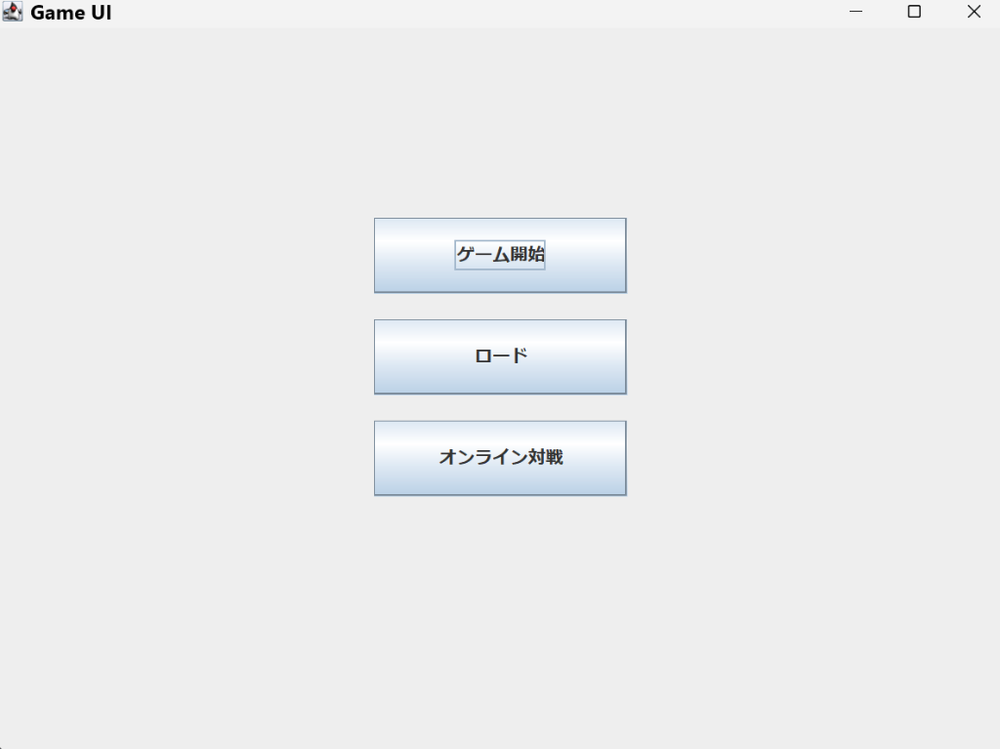
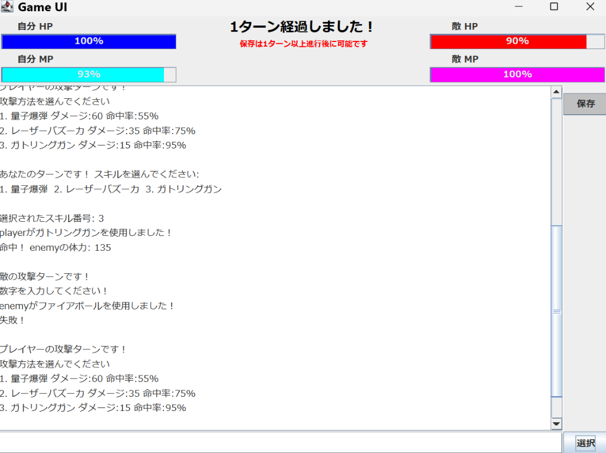

# Java Swing PVP Game

> **OOP原則に基づいた堅牢な設計とリファクタリング**
> **戦略的ターン制バトルゲーム**

**Java Swing PVP Game**は、Javaの標準ライブラリとSwingを用いて開発された、オブジェクト指向設計の真髄を体現した1対1の対戦型ゲームです。
単なるゲーム機能の実装にとどまらず、保守性(Maintainability)、拡張性(Extensibility)、そして安定性(Stability)を重視したアーキテクチャへと大規模なリファクタリングを実施しました。

> **リファクタリングのハイライト**:
> *   **BattleEngineの分離**: 肥大化したロジックを凝集度の高い専用クラスへ抽出
> *   **スレッドセーフ**: グローバル変数の排除と並行処理の適正化
> *   **安定したイベント処理**: Swingイベントリスナーの重複登録バグを根絶

## 📱 主な機能 (Key Features)

### 1. ⚔️ 戦略的ターン制バトル (Single & Multi)
- **シングルプレイ**: コンピュータ(CPU)との対戦モード。
- **マルチプレイ (Beta)**: ソケット通信(Socket Programming)を利用したP2P対戦機能。
    - *※現在はローカル環境(localhost)での動作確認用に設定されています。*
- **4つの職業**: メイジ、ガンナー、プリースト、ソードマスター。それぞれ異なるステータスとスキルセットを持ちます。
- **スキルシステム**: 各職業に固有のアルティメット、メイン、通常スキルがあり、MP管理が勝利の鍵となります。

### 2. 💾 ゲーム進行の保存と復元
- **セーブ機能**: 現在の体力、MP、ターン数、プレイヤー情報をファイル(`save.txt`)に保存。
- **ロード機能**: アプリを再起動しても、保存した状態から即座に再開可能。
- **安全性**: ファイルI/Oのエラーハンドリングとリソース管理(`try-with-resources`)を徹底。

### 3. 🎨 直感的な日本語GUI
- **完全日本語化**: メニュー、戦闘ログ、スキル説明など、すべてのテキストを日本語化。
- **視認性の高いフォント**: 日本語表示に最適化されたフォント(`Meiryo`)を採用し、文字化けや視認性の問題を解消。
- **リアルタイムステータス**: HP/MPバーによる視覚的なステータス表示。

## 📸 スクリーンショット (Screenshots)

| メインメニュー (Main Menu) | 戦闘画面 (Battle Screen) |
|:---:|:---:|
|  |  |

---

## 🛠 技術スタック (Tech Stack)

- **言語**: Java 17
- **UIフレームワーク**: Java Swing
- **アーキテクチャ**: MVCパターン (Model-View-Controller) ライクな階層設計
- **ビルドツール**: javac (標準JDK)
- **バージョン管理**: Git

---

## 🏗 リファクタリング詳細 (Refactoring Journey)

本プロジェクトの核心は、初期のプロトタイプコードから、企業のプロダクションレベルを意識したコードベースへの**進化プロセス**にあります。

### Phase 1: クリティカルな修正 (Stability)
- **イベントリスナー重複問題**: ゲームループ内で `ActionListener` が多重登録され、1回のクリックで複数回動作してしまうバグを修正。リスナーの登録解除と再登録のライフサイクルを適正化しました。
- **Busy-Waitの排除**: `while` ループと `Thread.sleep` による非効率な待機処理を、`java.util.concurrent.CountDownLatch` を用いたイベント駆動型の同期制御に置換。CPU負荷を劇的に低減しました。

### Phase 2: ロジックの凝集と分離 (Cohesion)
- **BattleEngineの導入**: `GameLogic` (新規ゲーム) と `LoadGameLogic` (ロードゲーム) に散在していた戦闘計算ロジックを `pvp.logic.BattleEngine` に集約。コードの重複を排除し、単体テストが可能な構造にしました。
- **Enumによる型安全性**: 整数(`int`)で管理されていたキャラクタータイプを `Enum` (`Character.Type`) に変更し、不正な値の混入を防ぎました。

### Phase 3: アーキテクチャの刷新 (Architecture)
- **ドメインと表現の分離**: `pvp.character` (モデル) と `GameUI` (ビュー) の責務を明確化。
- **グローバル状態の撤廃**: `Server.java` に存在した `public static` 変数を排除し、インスタンス変数による状態管理へ移行。マルチスレッド環境での安全性を確保しました。

---

## � プロジェクト構成 (Structure)

```
pvpGame/
├── pvp/
│   ├── character/      # キャラクター定義 (Mage, Gunner...)
│   ├── domain/         # ドメインモデル (BattleResultなど)
│   ├── logic/          # ゲームロジック (BattleEngine)
│   ├── network/        # 通信モジュール (Server, Client)
│   ├── GameUI.java     # GUI実装 (View)
│   ├── GameLogic.java  # ゲーム進行制御 (Controller)
│   └── LoadGameLogic.java # ロード機能制御
└── README.md
```

---

## 🚀 実行方法 (How to Run)

### 1. コンパイル

プロジェクトのルートディレクトリで以下のコマンドを実行してください。

```bash
# Windows (PowerShell)
javac -encoding UTF-8 -cp . pvp/*.java pvp/character/*.java pvp/logic/*.java pvp/domain/battle/*.java
```

### 2. 実行

```bash
# ゲームの起動
java -cp . pvp.Main
```

---

## 📜 ライセンス

このプロジェクトはポートフォリオ用途で公開されています。
